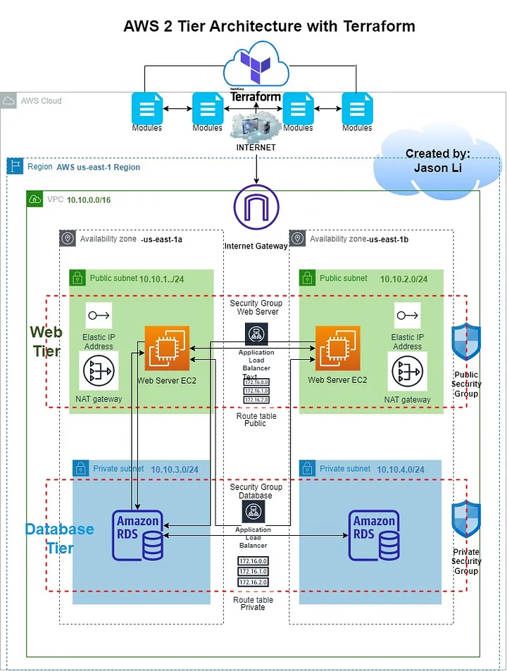

# Two-Tier-AWS-Architecture-with-Terraform
Aws two-tier projects

# *What is two-tier architecture ?*
  In a two-tier architecture, the client is on the first tier. The database server and web application server reside on the same server machine,
  which is the second tier.This second tier serves the data and executes the business logic for the web application.

  

  # Using terraform apply a changes on aws....

  
